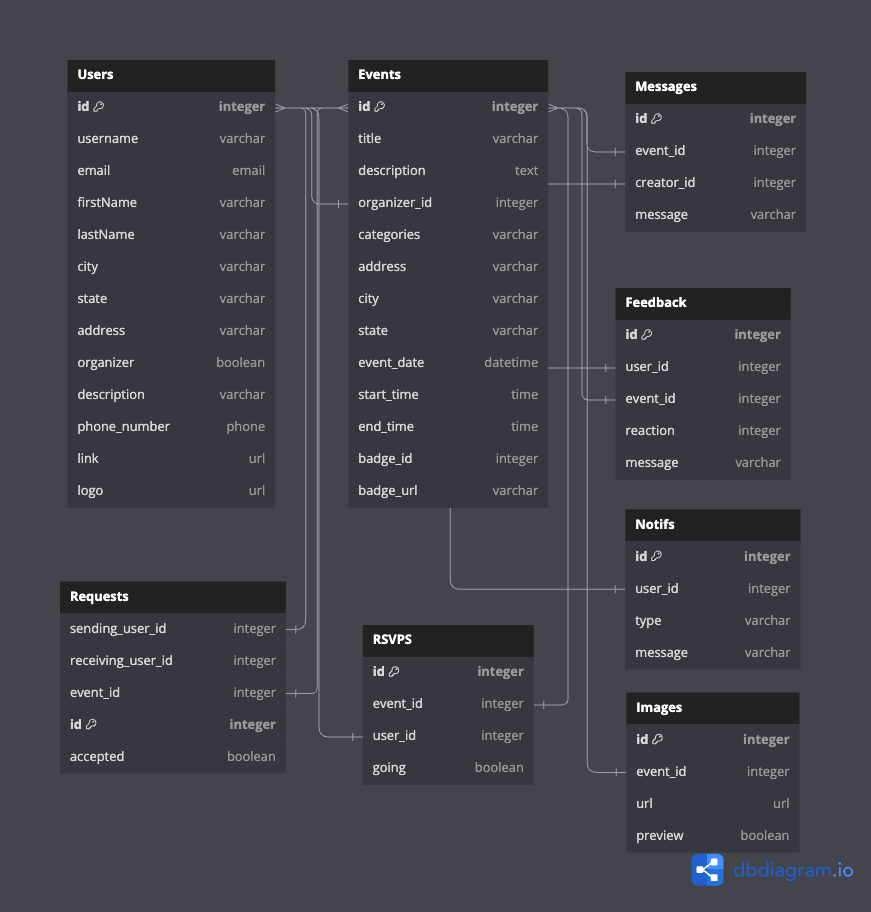

<div align="center">


# Sage

### Make volunteering easier to find — and more social to join.

A full-stack volunteer community platform for discovering opportunities, RSVPing to events, connecting with friends, and organizing groups to volunteer together.


</div>

---

## About Sage

Sage is a collaborative full-stack project built around a simple problem: finding a volunteer opportunity is only part of the challenge — people also need an easy way to commit, keep track of plans, and participate with others.

The application combines volunteer event discovery with lightweight social features. Users can browse opportunities, view organizer information, RSVP to events, connect with friends, create event-based groups, invite people to join, and communicate through a group message board.

The original product planning also explored broader ideas such as search, filtering, reminders, richer feedback, and impact tracking. This README focuses on functionality represented in the current codebase.

## Implemented Features

### Volunteer Events

- Browse upcoming and past volunteer opportunities
- View event descriptions, categories, dates, times, and locations
- Support both in-person and virtual opportunities
- View organizer information and community feedback
- See other users associated with an event

### RSVP Management

- RSVP to volunteer events
- Remove an existing RSVP
- View upcoming RSVP'd events
- Surface event history through the user profile

### Profiles

- Sign up, log in, and log out using session-based authentication
- View a personal dashboard
- Edit profile information
- Delete a profile
- View upcoming events, friends, groups, and earned event-based badges

### Friends & Requests

- Send friend requests
- Accept friend requests
- View current friends
- View individual friend profiles
- Compare shared past volunteer events

### Volunteer Groups

Users can turn an event into a shared plan instead of attending alone.

- Create a group around a volunteer event
- Add a group description
- Edit or delete groups as the owner
- Invite friends to a group
- Add or remove invited members
- View group members
- View all groups associated with the current user
- Navigate between a group and its volunteer event

### Group Message Board

Each group includes a simple event-specific message board.

- View messages within a group
- Post messages as a group member
- Display messages with the sender's name

## Tech Stack

| Layer | Technologies |
| --- | --- |
| Frontend | React 18, React Router, Redux, Redux Thunk, Vite, CSS, React Icons |
| Backend | Python 3.9, Flask, Flask-Login, Flask-WTF, Flask-CORS |
| Data | SQLAlchemy, Flask-SQLAlchemy, PostgreSQL, SQLite |
| Database migrations | Flask-Migrate, Alembic |
| Production server | Gunicorn |
| Infrastructure | Docker |
| Development | Git, GitHub |

## Architecture

Sage uses a React single-page application backed by a Flask REST API.

```text
React + Redux
     │
     │  /api/*
     ▼
Flask API
     │
     ▼
SQLAlchemy ORM
     │
     ├── SQLite      development
     └── PostgreSQL  production
```

During local development, Vite proxies `/api` requests to Flask on port `5000`.

For production builds, Flask is configured to serve the compiled React application from `react-vite/dist`.

## Data Model

The current application models several connected parts of the volunteer experience:

- **Users** — accounts, profile details, relationships, RSVPs, groups, and messages
- **Events** — volunteer opportunities with location, scheduling, categories, and organizer data
- **Organizers** — organizations associated with volunteer events
- **RSVPs** — user participation in events
- **Requests** — friend-request relationships between users
- **Groups** — user-created groups tied to individual events
- **Invites** — invitations connecting friends to volunteer groups
- **Messages** — group message-board posts
- **Feedback** — user reactions associated with organizers

### Database Schema



## My Contribution Focus

Sage was built collaboratively. My work in the repository focused heavily on turning the social/group portion of the product into a connected full-stack workflow.

My contributions include:

- Designed and documented early product requirements, user personas, user flows, user stories, API plans, and the database schema
- Helped structure the Flask + React project and Docker-based development/deployment setup
- Built and refined the **Group** data model and its relationships with users and events
- Implemented and tested group API routes
- Built group creation, viewing, editing, and deletion flows
- Connected group ownership and authorization behavior
- Built friend-to-group invitation flows and add/remove member behavior
- Added the event-specific group message board
- Integrated groups into event pages and the user profile/dashboard
- Worked through SQLAlchemy relationships, migrations, seed data, Redux state, and cross-feature integration issues

The repository history reflects additional collaborative work across events, authentication, profiles, RSVPs, friends, styling, and deployment.

## Project Documentation

The repository includes planning and technical documentation created during development:

- [Project Overview](./documentation/MVP/project-details/project-overview.md)
- [Feature Planning](./documentation/MVP/feature-list/features.md)
- [User Stories](./documentation/MVP/users/user-stories.md)
- [API Documentation](./documentation/SAGE_API_docs.md)
- [Database Schema](./documentation/db-schema/)
- [Wireframes](./documentation/wireframes/)
- [Future Feature Ideas](./documentation/SAGE_future_features.md)

> Some planning documents describe proposed or future functionality beyond what is currently implemented in the application.

## Local Development

### Prerequisites

- Python 3.9+
- Pipenv
- Node.js / npm

### 1. Clone the repository

```bash
git clone https://github.com/heykatie/Sage-by-TDZ.git
cd Sage-by-TDZ
```

### 2. Install backend dependencies

```bash
pipenv install -r requirements.txt
pipenv shell
```

### 3. Configure environment variables

Create a `.env` file in the project root based on `.env.example`.

For local SQLite development:

```env
SECRET_KEY=your-secret-key
DATABASE_URL=sqlite:///dev.db
SCHEMA=flask_schema
```

### 4. Initialize the database

```bash
flask db upgrade
flask seed all
```

### 5. Start the Flask API

```bash
flask run
```

The API runs on:

```text
http://127.0.0.1:5000
```

### 6. Start the React frontend

In a second terminal:

```bash
cd react-vite
npm install
npm run dev
```

Vite will start the frontend and proxy `/api` requests to the Flask server.

## API

The application exposes REST-style routes for:

```text
/api/auth
/api/users
/api/profile
/api/events
/api/rsvps
/api/friends
/api/requests
/api/groups
/api/invites
/api/messages
```

A development helper route is also available at:

```text
/api/docs
```

It returns the registered API routes and their docstrings.

For the project's written endpoint documentation, see [SAGE_API_docs.md](./documentation/SAGE_API_docs.md).

## Project Status

Sage is a completed collaborative learning project and portfolio codebase rather than an actively maintained production service.

There are areas that could be improved in a future iteration, including:

- automated test coverage
- stronger authorization checks across some routes
- cleanup of legacy and duplicate files
- more consistent API error handling
- completing unfinished feedback functionality
- aligning older planning documentation with the final implementation
- updating dependencies and build configuration

These are intentionally documented rather than presented as completed features.

## License

No license has been selected for this repository.

Until a license is added, the repository does not grant permission to reuse its source code or project assets.
